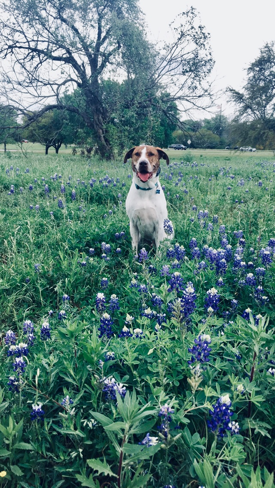

Currently seeking a position as a data scientist in a collaborative, fast-paced, and challenging environment. I like solving problems using a data driven approach. 

I earned my Ph.D. in Developmental Psychology (and a minor in Applied Statistical Modeling) at The University of Texas at Austin in April 2018. I earned my B.S. in Cognitive Science with a specialization in Neuroscience and a minor in Philosophy from UC San Diego in 2011. I also have a M.A. in Cognitive Neuroscience also from UT Austin (2015).

My research interests focus broadly on the developmental trajectory and stability of young children's academic achievement. I am also interested in the relationship between executive function (i.e., memory and self-control) and children's early understanding and interest in science. 

When not in the lab, I can usually be seen running, biking, swimming, hiking, or napping with my dog, Klaus. 

### Contact me
+ [jessie.raye.bauer@gmail.com](mailto:jessie.raye.bauer@gmail.com)

{:height="40%" width="40%"}  

